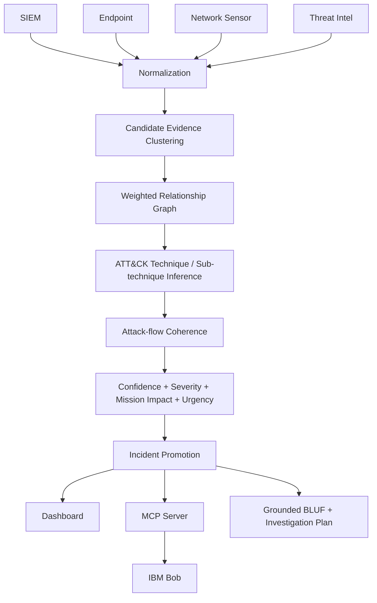

# Architecture

## System Architecture

## Components

| Component | Technology | Responsibility |
|---|---|---|
| Dashboard/API | FastAPI + vanilla JavaScript | Read-only incident, attack flow graph, timeline, and runbook views |
| Candidate clustering | Python (inverted entity index) | High-performance weighted entity links + continuous temporal decay |
| ATT&CK inference | Python + bundled ATT&CK reference | Sub-technique mapping with rationale/provenance |
| Attack-flow engine | Python | Tactic progression, depth and backtrack analysis |
| Risk engine | Python | Confidence, severity, mission impact and urgency |
| Runbook engine | Python | ATT&CK-mapped phased containment, eradication, and detection engineering |
| MCP server | JSON-RPC 2.0 over STDIO | Exposes grounded read-only investigation and runbook tools to Bob |
| Bob workflow | `.bob/mcp.json`, commands, skill | Analyst interaction, command triggers, and narrative synthesis |

## Key Design Guardrails

1. **Candidate ≠ incident.** Shared entities create hypotheses; promotion requires behavioral and corroborating evidence.
2. **Ground truth is offline-only.** `ground_truth.json` is consumed only by `src/evaluate.py`. It is never used by runtime promotion, the dashboard, or MCP.
3. **IOC semantics are explicit.** Public IP addresses remain ordinary IP entities unless an explicit threat-intelligence or indicator field identifies them as an IOC.
4. **ATT&CK mappings are evidence-backed.** RDP requires RDP evidence; LSASS behavior maps to T1003.001 rather than the broader T1003.
5. **Actor similarity is not attribution.** Historical ATT&CK technique overlap is presented only as behavioral consistency.

## Data Flow & Provenance Model

ThreatFusion supports multiple telemetry sources through a canonical normalization layer. Public real-world host/network datasets are used as reproducible samples where appropriate; CTI can be represented through curated snapshots and/or live feeds; SPARTA provides the space-cyber reference taxonomy; satellite telemetry in the demonstration remains synthetic.

Input records arrive in multiple schemas across host, network, CTI, and space telemetry feeds. The normalizer transforms each into a canonical representation while preserving explicit provenance (`synthetic`, `real_sample`, `curated_snapshot`, `live_feed`). Candidate edges combine relationship-specific weights, source separation and temporal decay. The resulting clusters are enriched with ATT&CK or SPARTA behavioral mappings. Attack-flow coherence, source independence, IOC specificity, negative evidence and asset criticality are then used to calculate separate decision dimensions. Only clusters that satisfy the promotion rules are escalated as incidents.

## Security & Provenance Considerations

- **Provenance Integrity:** Every record carries explicit origin and dataset provenance badges. Real-world samples (OTRF, CIC-IDS2017) are never conflated with live attacks, and satellite telemetry is explicitly marked as synthetic demonstration.
- **CTI & KEV Reproducibility:** ThreatFox IOCs and CISA Known Exploited Vulnerabilities (KEV) are stored as local curated snapshots to guarantee 100% deterministic, offline evaluation without runtime internet dependencies.
- **Taxonomy Boundaries:** MITRE ATT&CK and SPARTA (Aerospace Corp Space Attack Research & Tactic Analysis) operate in distinct framework namespaces; SPARTA techniques do not contaminate ATT&CK APT actor profiles.
- **Credentials & Access:** No credentials are stored in the repository.
- **Local MCP:** MCP runs locally over standard I/O (STDIO) rather than exposing network listeners.
- **Prototype Scope:** The prototype is evidence-backed and read-only with no autonomous containment actions.

## Scalability & Performance Optimization

The candidate clustering engine implements an **inverted entity index** (`entity -> list[record_indices]`) before evaluating pairwise edge strengths. Rather than executing a naive $O(N^2)$ comparison across all raw observations, it restricts temporal decay and weight calculations exclusively to record pairs sharing at least one common entity. On the demo dataset, this reduces pair evaluations from 666 down to 23 (a 96.5% reduction) while producing mathematically identical cluster boundaries. For enterprise-scale telemetry, the same graph model seamlessly operates over streaming sliding windows or distributed indices. STIX/TAXII 2.1 can be added at the ingestion boundary without altering internal representations.
